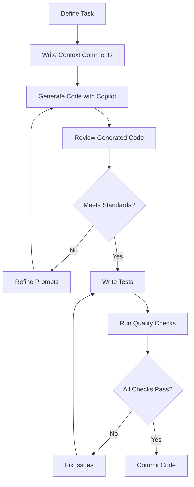

# Legend.md – .NET/C# AI Copilot Best Practices

> **Epic Root**: See [epic-root-outlooksync.md](./epic-root-outlooksync.md) for the main project documentation and guidelines.

This document consolidates best practices for .NET/C# development with AI Copilot assistance, combining architectural patterns, modern C# features, Domain-Driven Design (DDD), SOLID principles, and quality assurance standards.

## Table of Contents

1. [.NET Architecture Best Practices](#net-architecture-best-practices)
2. [C# 14 Modern Features](#c-14-modern-features)
3. [DDD (Domain-Driven Design) Mandatory Process](#ddd-domain-driven-design-mandatory-process)
4. [SOLID Principles](#solid-principles)
5. [Testing Conventions](#testing-conventions)
6. [Quality Checklist](#quality-checklist)
7. [AI Copilot Best Practices](#ai-copilot-best-practices)

---

## .NET Architecture Best Practices

> **Reference**: [dotnet-architecture-good-practices.md](./dotnet-architecture-good-practices.md)

### Core Principles

1. **Separation of Concerns**
   - Organize code into distinct layers (Presentation, Business Logic, Data Access)
   - Use dependency injection to decouple components
   - Keep each class focused on a single responsibility

2. **Clean Architecture**
   - Domain entities at the center (no dependencies)
   - Application layer for use cases
   - Infrastructure layer for external concerns
   - Presentation layer for UI/API

3. **Async/Await Pattern**
   - Always use `async`/`await` for I/O-bound operations
   - Avoid blocking calls like `.Result` or `.Wait()`
   - Configure await with `ConfigureAwait(false)` in library code

4. **Exception Handling**
   - Catch specific exceptions, not generic `Exception`
   - Use try-catch blocks at appropriate boundaries
   - Log exceptions with context information
   - Consider using Result/Either patterns for expected failures

5. **Configuration Management**
   - Use `IOptions<T>` pattern for strongly-typed configuration
   - Store secrets in secure vaults (Azure Key Vault, AWS Secrets Manager)
   - Never commit secrets to source control

6. **Dependency Injection**
   - Register services with appropriate lifetimes (Transient, Scoped, Singleton)
   - Use constructor injection for required dependencies
   - Avoid service locator anti-pattern

---

## C# 14 Modern Features

> **Reference**: [Microsoft Learn C# 14](https://learn.microsoft.com/en-us/dotnet/csharp/whats-new/csharp-14)

### Key Features to Leverage

1. **Primary Constructors** (C# 12+)
   ```csharp
   public class UserService(IUserRepository repository, ILogger<UserService> logger)
   {
       public async Task<User> GetUserAsync(int id) =>
           await repository.FindByIdAsync(id);
   }
   ```

2. **Collection Expressions** (C# 12+)
   ```csharp
   int[] numbers = [1, 2, 3, 4, 5];
   List<string> names = ["Alice", "Bob", "Charlie"];
   ```

3. **Record Types**
   ```csharp
   public record User(int Id, string Name, string Email);
   public record struct Point(int X, int Y);
   ```

4. **Pattern Matching**
   ```csharp
   var result = value switch
   {
       null => "null value",
       > 0 and < 10 => "single digit",
       >= 10 and < 100 => "double digit",
       _ => "other"
   };
   ```

5. **Nullable Reference Types**
   - Enable nullable reference types in project: `<Nullable>enable</Nullable>`
   - Use `?` for nullable types: `string?`
   - Use `!` null-forgiving operator sparingly

6. **Init-only Properties**
   ```csharp
   public class User
   {
       public int Id { get; init; }
       public string Name { get; init; } = string.Empty;
   }
   ```

7. **File-scoped Namespaces** (C# 10+)
   ```csharp
   namespace MyApp.Domain;

   public class User { }
   ```

---

## DDD (Domain-Driven Design) Mandatory Process

> **5-Step Process**: From Domain Analysis to Post-Implementation Review

### Step 1: Domain Analysis
**Objective**: Understand the business domain and identify core concepts

- **Activities**:
  - Conduct stakeholder interviews
  - Create ubiquitous language dictionary
  - Identify bounded contexts
  - Map domain entities, value objects, and aggregates
  - Document business rules and invariants

- **Deliverables**:
  - Domain model diagram
  - Ubiquitous language glossary
  - Bounded context map
  - Core domain identification

### Step 2: Strategic Design
**Objective**: Define boundaries and relationships between contexts

- **Activities**:
  - Define bounded contexts and their relationships
  - Identify aggregates and aggregate roots
  - Establish context mapping patterns (Shared Kernel, Customer-Supplier, etc.)
  - Define integration strategies between contexts

- **Deliverables**:
  - Context map diagram
  - Aggregate design specifications
  - Integration contract definitions

### Step 3: Tactical Design
**Objective**: Implement domain model with DDD building blocks

- **Key Patterns**:
  - **Entities**: Objects with identity (e.g., User, Order)
  - **Value Objects**: Immutable objects without identity (e.g., Money, Address)
  - **Aggregates**: Clusters of entities with single root
  - **Domain Services**: Operations that don't belong to entities
  - **Repositories**: Persistence abstraction for aggregates
  - **Domain Events**: Represent something that happened in the domain

- **Implementation Guidelines**:
  ```csharp
  // Entity example
  public class Order : Entity<OrderId>
  {
      private readonly List<OrderLine> _orderLines = new();
      public IReadOnlyCollection<OrderLine> OrderLines => _orderLines.AsReadOnly();
      
      public void AddOrderLine(Product product, int quantity)
      {
          // Business rule validation
          if (quantity <= 0)
              throw new DomainException("Quantity must be positive");
              
          _orderLines.Add(new OrderLine(product, quantity));
          AddDomainEvent(new OrderLineAddedEvent(Id, product.Id, quantity));
      }
  }

  // Value Object example
  public record Money(decimal Amount, string Currency)
  {
      public Money Add(Money other)
      {
          if (Currency != other.Currency)
              throw new InvalidOperationException("Cannot add different currencies");
          return this with { Amount = Amount + other.Amount };
      }
  }
  ```

### Step 4: Implementation & Testing
**Objective**: Build and validate the domain model

- **Activities**:
  - Implement domain entities and value objects
  - Create domain services and repositories
  - Write unit tests for business logic
  - Implement integration tests for use cases
  - Add domain event handlers

- **Testing Strategy**:
  - Unit tests: Test domain logic in isolation
  - Integration tests: Test use cases with infrastructure
  - Test edge cases and business rule violations

### Step 5: Post-Implementation Review
**Objective**: Validate implementation and refine understanding

- **Review Checklist**:
  - [ ] Does the code reflect the ubiquitous language?
  - [ ] Are business rules enforced by the domain model?
  - [ ] Are aggregates properly designed (consistency boundaries)?
  - [ ] Is the domain model isolated from infrastructure concerns?
  - [ ] Are domain events published for significant state changes?
  - [ ] Is the code testable and well-tested?
  - [ ] Have edge cases been identified and handled?
  - [ ] Is the implementation aligned with architectural guidelines?

- **Continuous Improvement**:
  - Refactor based on new domain insights
  - Update ubiquitous language as needed
  - Document architectural decisions

---

## SOLID Principles

> **Reference**: [CSharpExpert.agent.md](./CSharpExpert.agent.md)

### 1. Single Responsibility Principle (SRP)
**A class should have only one reason to change**

```csharp
// Bad: Multiple responsibilities
public class UserService
{
    public void CreateUser(User user) { }
    public void SendEmail(string to, string subject) { }
    public void LogActivity(string message) { }
}

// Good: Single responsibility
public class UserService
{
    private readonly IEmailService _emailService;
    private readonly ILogger<UserService> _logger;
    
    public void CreateUser(User user)
    {
        // User creation logic only
    }
}
```

### 2. Open/Closed Principle (OCP)
**Open for extension, closed for modification**

```csharp
// Good: Extension through abstraction
public interface IPaymentProcessor
{
    Task ProcessPaymentAsync(Payment payment);
}

public class CreditCardProcessor : IPaymentProcessor { }
public class PayPalProcessor : IPaymentProcessor { }
```

### 3. Liskov Substitution Principle (LSP)
**Derived classes must be substitutable for base classes**

```csharp
public abstract class Shape
{
    public abstract double CalculateArea();
}

public class Rectangle : Shape
{
    public double Width { get; set; }
    public double Height { get; set; }
    
    public override double CalculateArea() => Width * Height;
}
```

### 4. Interface Segregation Principle (ISP)
**Clients should not depend on interfaces they don't use**

```csharp
// Good: Segregated interfaces
public interface IReadRepository<T>
{
    Task<T> GetByIdAsync(int id);
    Task<IEnumerable<T>> GetAllAsync();
}

public interface IWriteRepository<T>
{
    Task AddAsync(T entity);
    Task UpdateAsync(T entity);
    Task DeleteAsync(int id);
}
```

### 5. Dependency Inversion Principle (DIP)
**Depend on abstractions, not concretions**

```csharp
// Good: Dependency on abstraction
public class OrderService
{
    private readonly IOrderRepository _repository;
    private readonly IEmailService _emailService;
    
    public OrderService(IOrderRepository repository, IEmailService emailService)
    {
        _repository = repository;
        _emailService = emailService;
    }
}
```

---

## Testing Conventions

### Naming Convention: MethodName_Condition_ExpectedResult()

```csharp
public class UserServiceTests
{
    [Fact]
    public void CreateUser_ValidUser_ReturnsCreatedUser()
    {
        // Test implementation
    }
    
    [Fact]
    public void CreateUser_NullUser_ThrowsArgumentNullException()
    {
        // Test implementation
    }
    
    [Fact]
    public void GetUser_UserDoesNotExist_ReturnsNull()
    {
        // Test implementation
    }
}
```

### AAA Pattern (Arrange-Act-Assert)

```csharp
[Fact]
public void AddOrderLine_ValidProduct_AddsLineToOrder()
{
    // Arrange
    var order = new Order(new OrderId(1));
    var product = new Product(new ProductId(1), "Widget", 10.00m);
    var quantity = 5;
    
    // Act
    order.AddOrderLine(product, quantity);
    
    // Assert
    Assert.Single(order.OrderLines);
    Assert.Equal(product.Id, order.OrderLines.First().ProductId);
    Assert.Equal(quantity, order.OrderLines.First().Quantity);
}
```

### Coverage Requirements

- **Minimum Coverage**: >85% code coverage
- **Focus Areas**:
  - Business logic: 100% coverage
  - Domain entities and value objects: 100% coverage
  - API controllers: >90% coverage
  - Infrastructure: >80% coverage

### Test Categories

1. **Unit Tests**
   - Test single components in isolation
   - Mock all dependencies
   - Fast execution (<10ms per test)

2. **Integration Tests**
   - Test component interactions
   - Use real dependencies when possible
   - Test database operations, API calls

3. **End-to-End Tests**
   - Test complete user scenarios
   - Validate system behavior
   - Run in CI/CD pipeline

### Testing Best Practices

```csharp
// Use Theory for parameterized tests
[Theory]
[InlineData(0, false)]
[InlineData(-1, false)]
[InlineData(1, true)]
[InlineData(100, true)]
public void IsValidQuantity_VariousInputs_ReturnsExpected(int quantity, bool expected)
{
    var result = OrderValidator.IsValidQuantity(quantity);
    Assert.Equal(expected, result);
}

// Use fixtures for test data
public class UserTestFixture
{
    public User CreateValidUser() => new User
    {
        Id = 1,
        Name = "John Doe",
        Email = "john@example.com"
    };
}

// Use descriptive assertion messages
Assert.True(result.IsSuccess, $"Expected success but got error: {result.Error}");
```

---

## Quality Checklist

### Mandatory Verification Statements

Before committing code, verify:

- [ ] **Compilation**: Code compiles without errors or warnings
- [ ] **Tests**: All tests pass (unit, integration, e2e)
- [ ] **Coverage**: Code coverage meets >85% threshold
- [ ] **Linting**: No linting errors (dotnet format, StyleCop)
- [ ] **Static Analysis**: No security or quality issues (SonarQube, CodeQL)
- [ ] **Code Review**: Code reviewed by at least one peer
- [ ] **Documentation**: Public APIs documented with XML comments
- [ ] **Breaking Changes**: No breaking changes without major version bump
- [ ] **Performance**: No performance regressions
- [ ] **Security**: No vulnerabilities introduced (dependency scan, OWASP)

### Edge Cases Exploration Checklist

When implementing features, consider:

#### Null and Empty Values
- [ ] What happens if input is `null`?
- [ ] What happens if string is empty or whitespace?
- [ ] What happens if collection is empty?

#### Boundary Conditions
- [ ] What happens at minimum value (0, -∞)?
- [ ] What happens at maximum value (int.MaxValue, ∞)?
- [ ] What happens just before/after boundaries?

#### Error Conditions
- [ ] What happens if database is unavailable?
- [ ] What happens if external API fails?
- [ ] What happens if file doesn't exist?
- [ ] What happens if network connection is lost?

#### Concurrent Access
- [ ] What happens if two users modify the same entity?
- [ ] What happens if the same operation is triggered multiple times?
- [ ] Are there race conditions?

#### Data Validation
- [ ] Are all inputs validated?
- [ ] Are business rules enforced?
- [ ] Are constraints checked?

#### Resource Management
- [ ] Are disposable resources properly disposed?
- [ ] Are connections properly closed?
- [ ] Are memory leaks prevented?

### Pre-Commit Checklist

```bash
# Run before committing
dotnet format                           # Format code
dotnet build                            # Build solution
dotnet test                             # Run all tests
dotnet test --collect:"XPlat Code Coverage"  # Check coverage
```

---

## AI Copilot Best Practices

### Working with GitHub Copilot

1. **Provide Context**
   - Write clear comments describing intent
   - Use descriptive variable and method names
   - Include type information

2. **Review Suggestions**
   - Always review generated code
   - Verify business logic correctness
   - Check for security vulnerabilities
   - Ensure SOLID principles are followed

3. **Iterative Refinement**
   - Start with simple prompts
   - Refine suggestions through comments
   - Break complex tasks into smaller parts

4. **Domain-Specific Guidance**
   ```csharp
   // Copilot will use this context for better suggestions
   // This is a domain entity representing a customer order
   // It must enforce the invariant that order total >= 0
   // It should publish OrderCreatedEvent when created
   public class Order : Entity<OrderId>
   {
       // Copilot suggestion here will be domain-aware
   }
   ```

### CSharpExpert Agent Guidelines

> **Reference**: [CSharpExpert.agent.md](./CSharpExpert.agent.md)

When working with the CSharpExpert agent:

1. **Specify Requirements Clearly**
   - State the problem domain
   - Mention architectural patterns (DDD, CQRS, etc.)
   - Specify C# version and framework version

2. **Request Best Practices**
   - Ask for SOLID principles application
   - Request async/await patterns
   - Request proper exception handling

3. **Validate Suggestions**
   - Ensure suggestions follow this legend
   - Verify domain model integrity
   - Check test coverage

### AI-Assisted Development Workflow



---

## Summary

This legend provides a comprehensive guide for .NET/C# development with AI assistance. Key takeaways:

1. **Architecture**: Follow clean architecture principles and separation of concerns
2. **Modern C#**: Leverage C# 14 features for cleaner, more expressive code
3. **DDD Process**: Follow the 5-step process from analysis to review
4. **SOLID**: Apply SOLID principles for maintainable, extensible code
5. **Testing**: Use MethodName_Condition_ExpectedResult(), AAA pattern, >85% coverage
6. **Quality**: Complete mandatory verification checklist before committing
7. **AI Copilot**: Provide context, review suggestions, iterate

### Quick Reference Links

- [epic-root-outlooksync.md](./epic-root-outlooksync.md) - Main project documentation
- [dotnet-architecture-good-practices.md](./dotnet-architecture-good-practices.md) - Architecture guidelines
- [CSharpExpert.agent.md](./CSharpExpert.agent.md) - AI agent guidelines
- [Microsoft Learn C# 14](https://learn.microsoft.com/en-us/dotnet/csharp/whats-new/csharp-14) - Language features

---

*Last Updated: 2026-02-10*
*Version: 1.0*
